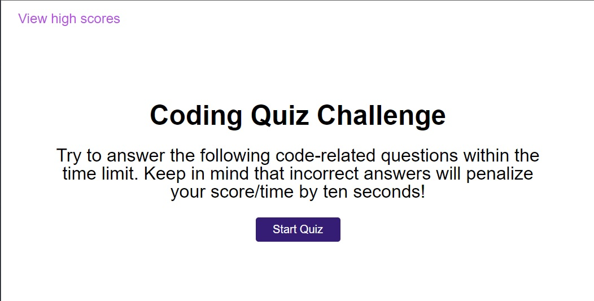
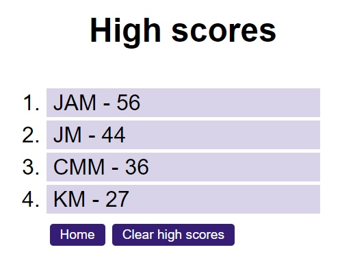

# Code Quiz

## Description

This is a short 5 question quiz on JavaScript basics. I created this quiz from start to finish to test and exercise my knowledge and implementation of the DOM, event propagation and handling functions, and storing and retrieving data using the browser's local storage.

## Installation

N/A

## Usage

To take the quiz simply, click 'Start Quiz' on the landing page, answer the five question as quickly and accuratly as you can, then when you're finished simply enter your initials and you'll be taken to the high scores page where you can view your results and anyone elses' who has taken the quiz on your current device. Have your friends and coworkers take it and see how your scores compare!

## License

Please refer to the license in the root folder
